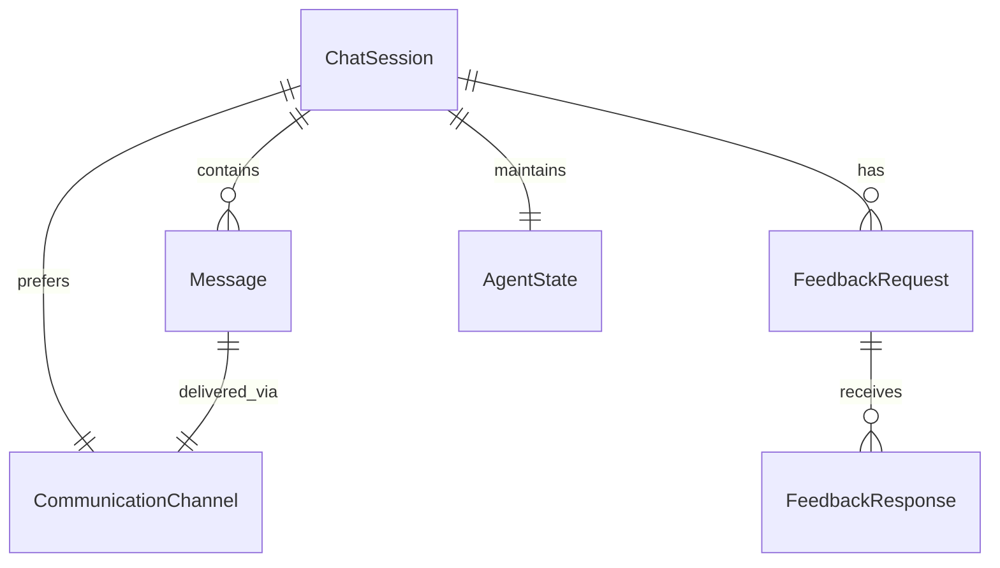
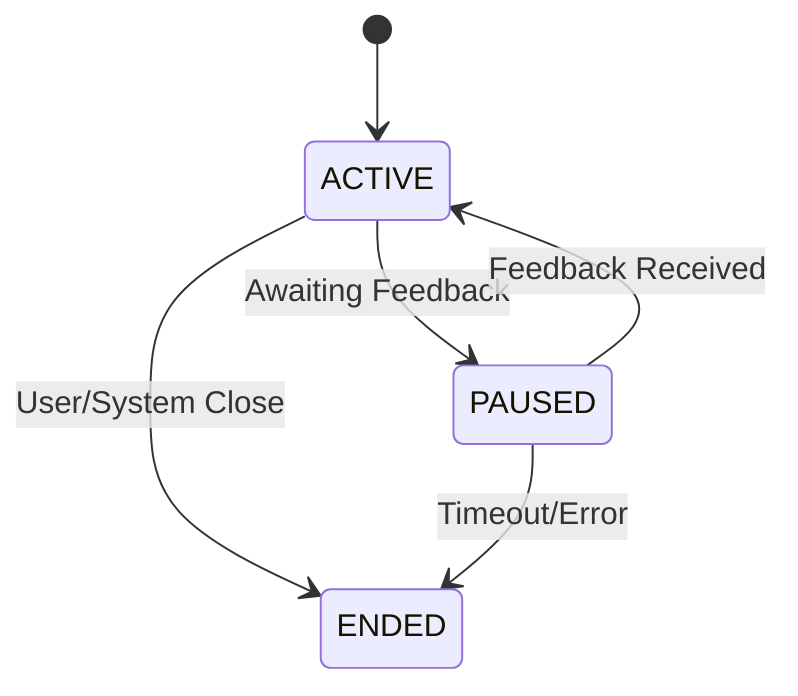
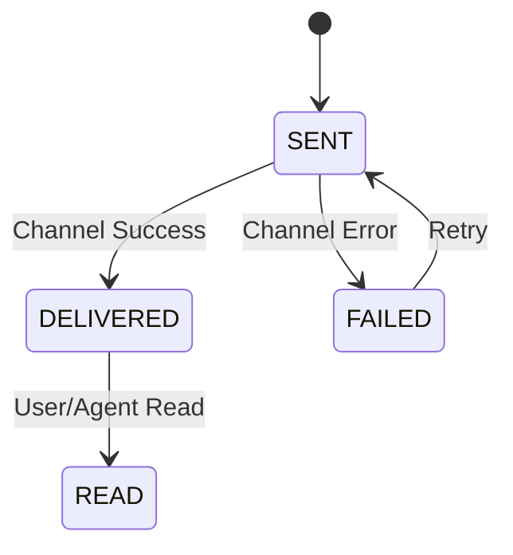
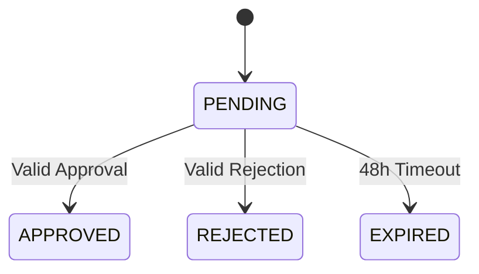

# Data Model Specification

## Entity Relationships



## Entities

### ChatSession

```typescript
interface ChatSession {
  id: string; // Unique session identifier
  userId: string; // Associated user ID
  status: SessionStatus; // Active, Paused, Ended
  createdAt: Date; // Session creation timestamp
  updatedAt: Date; // Last activity timestamp
  preferredChannel: ChannelType; // User's preferred communication channel
  messages: Message[]; // Conversation history
  feedbackRequests: FeedbackRequest[]; // Associated feedback requests
  metadata: {
    // Session metadata
    userAgent: string; // Client information
    ipAddress: string; // User's IP address
    lastActive: Date; // Last user activity
  };
}

enum SessionStatus {
  ACTIVE = "active",
  PAUSED = "paused",
  ENDED = "ended",
}
```

### Message

```typescript
interface Message {
  id: string; // Unique message identifier
  sessionId: string; // Associated chat session
  content: string; // Message content
  type: MessageType; // User, Agent, or System
  timestamp: Date; // Creation timestamp
  status: MessageStatus; // Sent, Delivered, Read
  channel: ChannelType; // Delivery channel used
  metadata: {
    // Message metadata
    streamingComplete?: boolean; // For agent responses
    errorCount?: number; // Delivery attempt count
    retryTimestamp?: Date; // Next retry time
  };
}

enum MessageType {
  USER = "user",
  AGENT = "agent",
  SYSTEM = "system",
}

enum MessageStatus {
  SENT = "sent",
  DELIVERED = "delivered",
  READ = "read",
  FAILED = "failed",
}
```

### FeedbackRequest

```typescript
interface FeedbackRequest {
  id: string; // Unique request identifier
  sessionId: string; // Associated chat session
  type: FeedbackType; // Approval or Input
  status: FeedbackStatus; // Pending, Approved, Rejected, Expired
  prompt: string; // Request description
  createdAt: Date; // Creation timestamp
  expiresAt: Date; // Expiration timestamp (48h)
  channels: ChannelType[]; // Attempted channels
  responses: FeedbackResponse[]; // Received responses
  metadata: {
    // Request metadata
    priority: number; // Request priority
    attemptsCount: number; // Delivery attempts
    lastAttempt: Date; // Last attempt timestamp
  };
}

enum FeedbackType {
  APPROVAL = "approval",
  INPUT = "input",
}

enum FeedbackStatus {
  PENDING = "pending",
  APPROVED = "approved",
  REJECTED = "rejected",
  EXPIRED = "expired",
}
```

### FeedbackResponse

```typescript
interface FeedbackResponse {
  id: string; // Unique response identifier
  requestId: string; // Associated request ID
  content: string; // Response content
  channel: ChannelType; // Response channel
  timestamp: Date; // Response timestamp
  responderId: string; // User who responded
  metadata: {
    // Response metadata
    valid: boolean; // Response validity
    processedAt: Date; // Processing timestamp
  };
}
```

### AgentState

```typescript
interface AgentState {
  id: string; // Unique state identifier
  sessionId: string; // Associated session
  status: AgentStatus; // Current agent status
  context: {
    // Preserved context
    lastMessage: string; // Last processed message
    pendingActions: string[]; // Queued actions
    variables: Record<string, any>; // State variables
  };
  feedback: {
    // Feedback state
    pending: string[]; // Pending request IDs
    processing: string[]; // Processing request IDs
  };
  timestamp: Date; // Last update timestamp
}

enum AgentStatus {
  ACTIVE = "active",
  THINKING = "thinking",
  PAUSED = "paused",
  AWAITING_FEEDBACK = "awaiting_feedback",
}
```

### CommunicationChannel

```typescript
interface CommunicationChannel {
  type: ChannelType; // Channel type
  status: ChannelStatus; // Channel status
  config: {
    // Channel configuration
    priority: number; // Failover priority
    retryLimit: number; // Max retry attempts
    timeout: number; // Operation timeout
  };
  metadata: {
    // Channel metadata
    lastError?: string; // Last error message
    lastSuccess?: Date; // Last successful operation
    healthCheck?: Date; // Last health check
  };
}

enum ChannelType {
  CHAT = "chat",
  EMAIL = "email",
  SLACK = "slack",
}

enum ChannelStatus {
  ACTIVE = "active",
  INACTIVE = "inactive",
  ERROR = "error",
}
```

## Validation Rules

### ChatSession

- Maximum 3 concurrent active sessions per user
- Must have valid userId and preferredChannel
- Cannot update ended sessions

### Message

- Content cannot be empty
- Must have valid sessionId and channel
- Timestamp cannot be in future

### FeedbackRequest

- Must have valid sessionId and type
- ExpiresAt must be 48 hours from creation
- Cannot modify after expiration
- Must have at least one channel

### FeedbackResponse

- Must have valid requestId
- Content cannot be empty
- Cannot modify after processing
- Must come from authorized responder

### AgentState

- Must have valid sessionId
- Cannot have conflicting status and pending actions
- Context size must be within limits

### CommunicationChannel

- Must have valid priority (1-3)
- Retry limit cannot exceed 10
- Timeout cannot exceed 1 hour

## State Transitions

### ChatSession



### Message



### FeedbackRequest



## Database Indexes

### Primary Indexes

- ChatSession: id
- Message: id, sessionId
- FeedbackRequest: id, sessionId
- FeedbackResponse: id, requestId
- AgentState: id, sessionId
- CommunicationChannel: type

### Secondary Indexes

- ChatSession: userId, status
- Message: timestamp, type, status
- FeedbackRequest: status, expiresAt
- FeedbackResponse: timestamp, channel
- AgentState: status, timestamp

## Rate Limiting

- Per user: 30 requests/minute
- Per session: 10 requests/minute
- Per channel: 20 requests/minute
